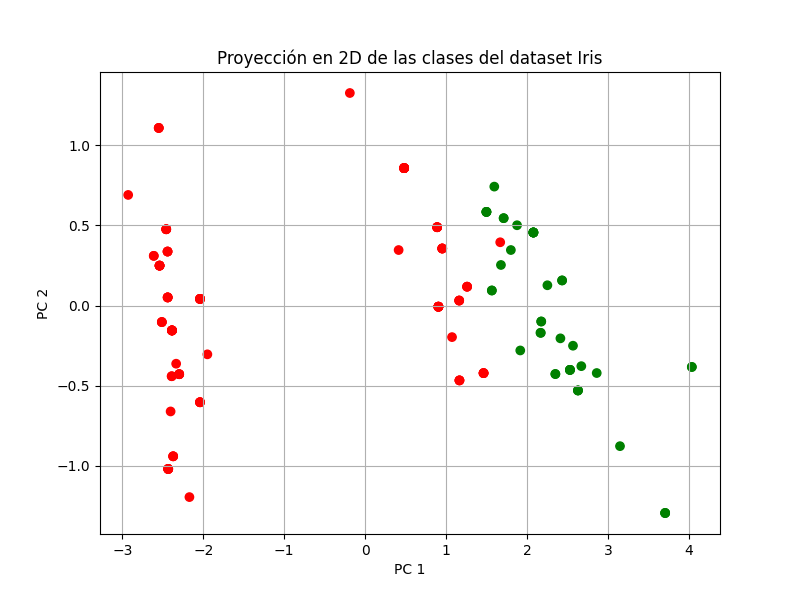
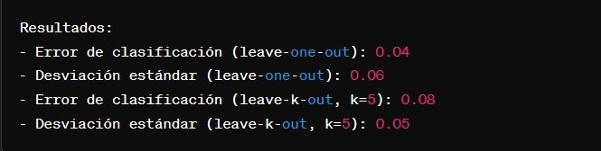

# Practica-1-Ejercicio-4
# Perceptrón Multicapa en Python

## Descripción de la Actividad

Este repositorio contiene la implementación de un algoritmo de retropropagación para un perceptrón multicapa en Python. La actividad consiste en la clasificación de datos utilizando una red neuronal artificial, con la capacidad de configurar libremente la cantidad de capas y neuronas por capa.

### Funcionamiento del Programa

1. **Lectura de Datos**: El programa carga los datos desde el archivo `concentlite.csv`.
2. **Configuración de la Red Neuronal**: Se define la arquitectura de la red, incluyendo el número de capas ocultas y neuronas por capa.
3. **Entrenamiento de la Red Neuronal**: Se entrena la red utilizando el algoritmo de retropropagación durante un número de épocas especificado.
4. **Clasificación de Datos**: Se utilizan los datos de entrada para realizar predicciones con la red neuronal.
5. **Visualización de Resultados**: Se grafican los datos junto con la clasificación realizada por la red neuronal.

## Archivos

En este repositorio se encuentran los siguientes archivos:

- [El código fuente](codigo.py) Codigo fuente del programa
- [El archivo de datos](irisbin.csv) Archivo de datos de entrada
- [Reporte](Reporte.pdf) Informe detallado sobre la implementación del algoritmo y los resultados obtenidos.

De igual forma aqui se muestran los resultados:

## Autor

- **Cárdenas Pérez Calvin Cristopher**
